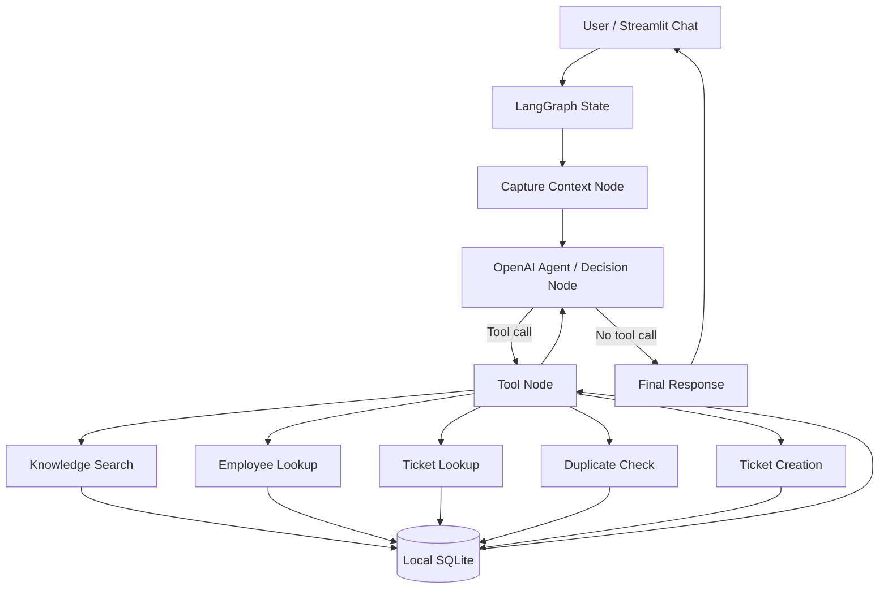

# Architecture

## High-level design

## LangGraph elements demonstrated

- **State:** conversation messages plus remembered employee ID.
- **Nodes:** context capture, agent/decision node, and tool-execution node.
- **Edges:** start → context → agent; tools → agent.
- **Conditional routing:** the graph routes to tools only when the model emits a tool call; otherwise it ends with the final answer.
- **Tool execution:** all business data comes from local tools and SQLite.
- **Memory:** `InMemorySaver` persists state within a Streamlit conversation thread using `thread_id`.

## Safety design

Ticket creation validates required data and the employee before insertion. A duplicate check runs before ticket creation. Tool failures return structured results. The assistant is instructed not to invent ticket information and should clearly distinguish retrieved records from generated guidance.
